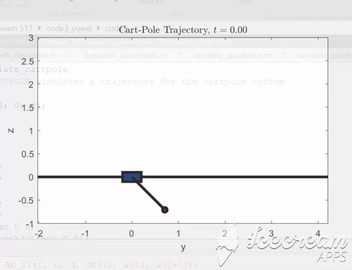
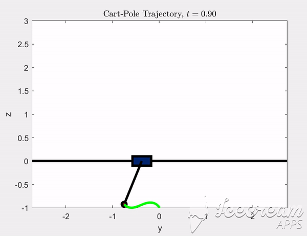

# Cart-Pole-Control-and-Optimization
Trajectory optimization on the classic cart-pole swing-up problem

Two control strategies to drive the pole to upright position are implemented and compared 

#Method 1: Energy Shaping
Partial feedback linearization is used and a lyapunov function is defined to drive the ennergy down to zero at the upright postion.

#Method 2: Direct Collacation
Trajectory optimization using direct collocation to minimize the total control effort, resulting in a much more efficient manuever. 

